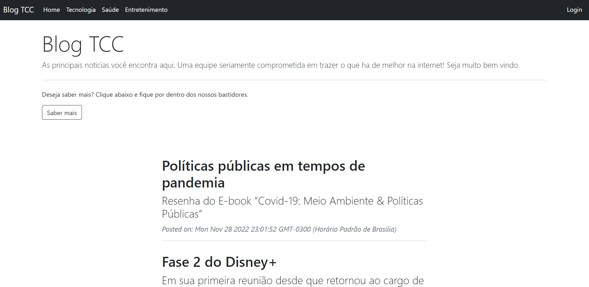
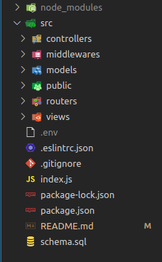
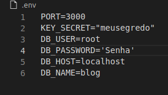
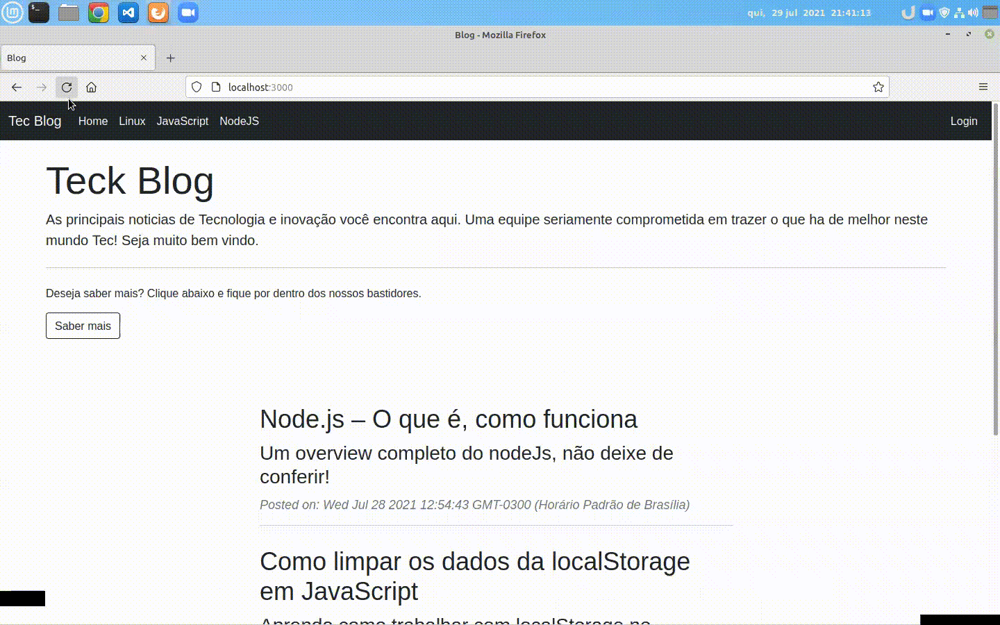
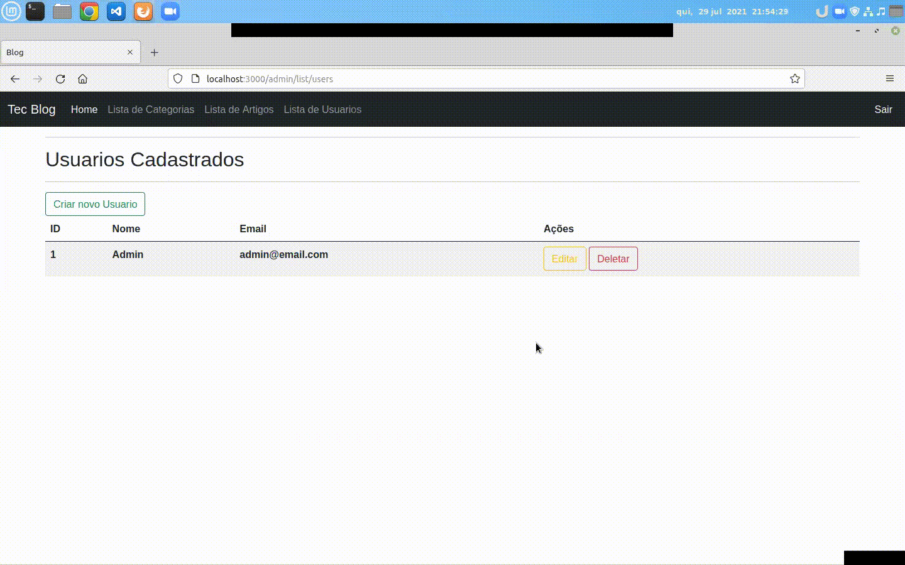
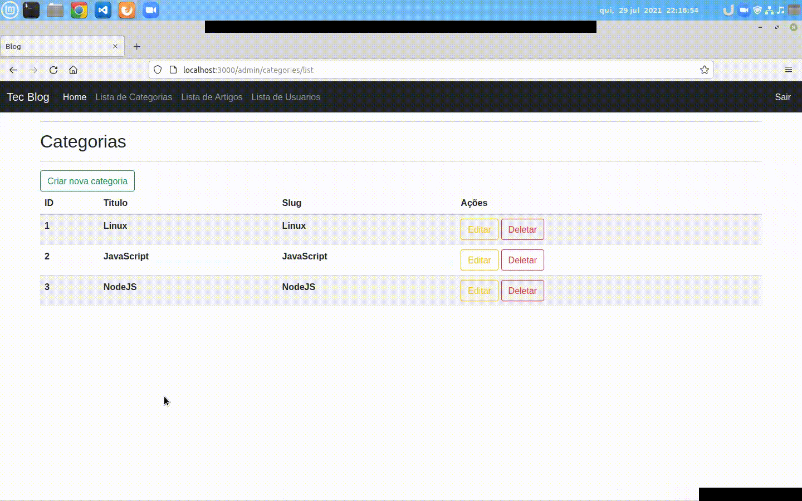

## Blog com painel Administrativo em Node.JS 🚀

Olá seja bem vindo ao repositório do projeto Blog.

Este projeto consiste em uma aplicação na arquitetura MVC utilizando NodeJs, e com banco de dados
Mysql. Neste Blog é possivel fazer cadastro de novos usuários, com o cadastro feito é possivel criar,
editar e deletar artigos, categorias e usuários. A finalidade deste projeto foi fazer um sistema onde 
usuários cadastrados tenham as mesmas permissões de fazer qualquer coisa. Na parte de criação de artigos
utilizei o [TinyMCE](https://www.tiny.cloud/) para ter um editor de texto completo. Siga no readme e
conheça melhor o projeto, foi bem desafiador e no final de tudo eu percebi o quanto aprendi e me
desenvolvi com esta experiência.

Abaixo demonstro a pagina inicial do Blog sem nenhum Artigo cadastrado.

## Estrutura

`MVC` - MODEL, VIEWS e CONTROLLERS

1. MODEL: É responsável por toda interface com banco de dados, query's, conexão etc.
2. VIEWS: Se encontram todos os arquivos .ejs que renderizam as paginas e interface gráfica do sistema.
neste caso os arquivos são .ejs view engine utilizada.
3. CONTROLLERS: É responsável em ligar o model com as views, fazendo o meio de campo da arquitetura.
4. PUBLIC: Contém as imagens utilizadas no projeto, arquivos estáticos CSS e javaSript.
5. ROUTERS:  Possui as rotas da aplicação, sistema de rotas próprio do framework Express.
6. MIDDLEWARES: Possui os middlewares da aplicação, no caso temos o de autenticação.

## tecnologias utilizadas

- Linguagens:
  - NodeJs
- Framework's:
  - Express
- Banco de dados:
  - Mysql
- Segurança:
  - bcryptjs
  - express-session
- Padronização de URL:
  - slugify
- Configurações
  - Dotenv
- View engine:
  - EJS
- Estilos:
  - Bootstrap
- Facilitador de desenvolvimento:
  - nodemon
- Organização e Padronização de codigo:
  - Eslint / config-airbnb-base

  ## Avisos

- Este projeto necessita do NodeJs instalado em seu computador e o banco de dados Mysql 
para rodar localmente.

- As demais dependêcias são instaladas com o comando npm install.

- Crie um arquivo .env na raiz da pasta SRC com as seguintes variáveis de ambiente:
  - PORT= 'Porta da aplicação, normalmente 3000'
  - KEY_SECRET= 'Segredo para express-session'
  - DB_USER= 'User banco de dados'
  - DB_PASSWORD= 'Senha banco se houver'
  - DB_HOST= 'host do banco normalmente localhost'
  - DB_NAME= 'nome do banco: 'blog''

- na raiz do projeto existe um arquivo `schema.sql`. copie e execute esse shema do banco
para o funcionamento do projeto.

- Na tabela users já vem cadastrado um usuário ADM, seu email e: `admin@email.com` e sua senha
e `admin123`. Utilize para realizar login na plataforma.

## Executando

Após as configurações, execute na raiz da pasta SRC o comando npm start ou npm run debug.

Verifique o package.json, la se encontram scripts para execução do projeto.

- `"debug": "nodemon index.js", (npm run debug) inicia o projeto com nodemon.`
- `"start": "node index.js", (npm start) inicia o projeto com node.`

## Funcionalidades principais

Abaixo estou ilustrando a página inicial da aplicação, com artigos cadastrados.

### - Login de usuário
 Abaixo demonstro o login de usuário com validação de email e senha. Automaticamente com o login validado
 o usuário é redirecionado para lista de artigos cadastrados no banco de dados.
 O express-session cria uma sessão que expira em 1 hora, isto é configuravel no aquivo index nas configurações do express-session.

## - Painel Administrativo
 Após logado o usuário tem acesso ao painel administrativo, onde é possivel, criar Artigos, categorias,
 usuários, editar e deletar. Um CRUD completo. A partir da senha é gerado um hash com a biblioteca `bcryptjs`, e a sessão do usuário e validada com o `express-session`.

 - Abaixo exemplifico cadastro, edição e exlusão de usuários

 

 - Abaixo exemplifico cadastro, edição e exclusão de categorias

 

 - Abaixo exemplifico cadastro, edição e exclusão de artigo

 